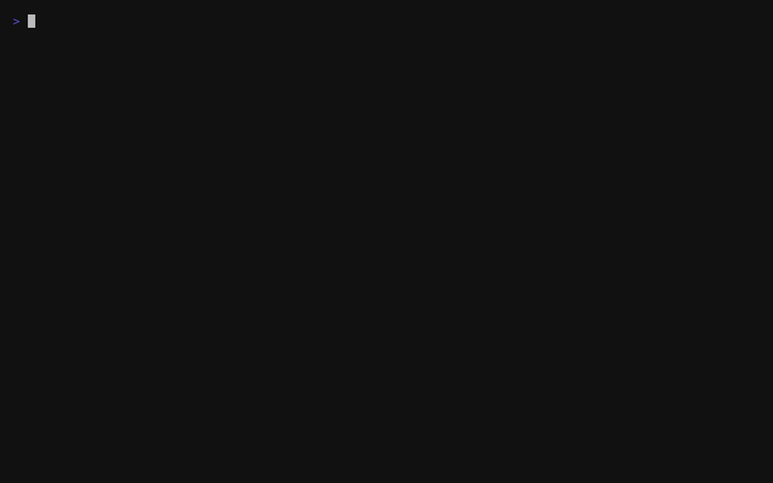

# markdown

Streaming Markdown parsing and terminal rendering in Go. Parse
incrementally, render immediately, keep memory bounded.

<!-- TODO: replace with recorded GIF once vhs capture is done -->
<!--  -->

```text
chunks --> stream.Parser --> events --> terminal.Renderer --> output
```

## Demo

See the streaming renderer in action:

```bash
# Stream the built-in showcase
go run ./examples/demo

# Stream any Markdown file
go run ./examples/demo README.md

# Tune the streaming effect
go run ./examples/demo --chunk 10 --delay 30ms

# Render instantly
go run ./examples/demo --instant
```

## Features

| Feature            | Status    | Notes                          |
| ------------------ | --------- | ------------------------------ |
| ATX headings       | supported | levels 1-6                     |
| Paragraphs         | supported | soft wraps, hard breaks        |
| Fenced code        | supported | Go fast path + Chroma fallback |
| Indented code      | supported | 4-space blocks                 |
| Tables             | supported | alignment, pipe-less rows      |
| Task lists         | supported | checked and unchecked items    |
| Blockquotes        | supported | nested, lazy continuation      |
| Ordered lists      | supported | start number, marker changes   |
| Unordered lists    | supported | nested sublists                |
| Emphasis / strong  | supported | `*` and `_` delimiters         |
| ~~Strikethrough~~  | supported | GFM extension                  |
| `Code spans`       | supported | backtick runs                  |
| Links              | supported | inline, reference, autolinks   |
| Images             | supported | alt text as link               |
| Thematic breaks    | supported | `---`, `***`, `___`            |
| Setext headings    | supported | `=` and `-` underlines         |
| HTML blocks        | supported | all 7 CommonMark types         |

## Packages

- **`stream`** — incremental parser, append-only event model
- **`terminal`** — terminal renderer over `stream.Event`
- **`examples/demo`** — streaming showcase with recording support
- **`examples/stream-readme`** — minimal streaming example

## Quick Start

```go
package main

import (
    "os"
    "github.com/codewandler/markdown/terminal"
)

func main() {
    r := terminal.NewStreamRenderer(os.Stdout)
    r.Write([]byte("# Hello\n\nThis is **streaming** Markdown.\n"))
    r.Flush()
}
```

## Terminal Renderer

The renderer uses a Monokai-inspired palette with configurable code block
borders, padding, and indentation. Key features:

- **Syntax highlighting** — Go via stdlib AST (fast path), other languages
  via Chroma with 24-bit truecolor
- **OSC 8 hyperlinks** — inline and reference links are clickable in
  supported terminals
- **Word wrapping** — auto-detected terminal width, configurable via
  `WithWrapWidth`
- **TTY detection** — ANSI escapes are stripped automatically when output
  is piped or redirected

The renderer never parses Markdown syntax. It only consumes parser events.

## Conformance

| Spec              | Pass Rate | Examples |
| ----------------- | --------- | -------- |
| CommonMark 0.31.2 | **96.2%** | 627/652  |
| GFM 0.29          | **100%**  | 672/672  |

The test suite includes:

- **Corpus classification** — every CommonMark and GFM example tracked
- **Split equivalence** — every example parsed at every chunk boundary
- **Structural assertions** — 627 CommonMark + 24 GFM extension examples
  verified for block structure, inline styles, and text content
- **Event invariants** — balanced enter/exit, correct nesting
- **Fuzz testing** — 3 `testing.F` targets, 1300+ seeds, 40+ pathological
  inputs
- **Memory retention** — completed blocks released promptly

```bash
go test ./stream ./terminal .
```

## Design Rules

1. Parser is **append-only** — no backtracking or re-parsing
2. Events emit at **block boundaries** — not deferred until flush
3. Memory bounded by **unresolved state** — not document size
4. Renderer **never parses** Markdown syntax
5. Terminal rendering is the **first-class output path**
